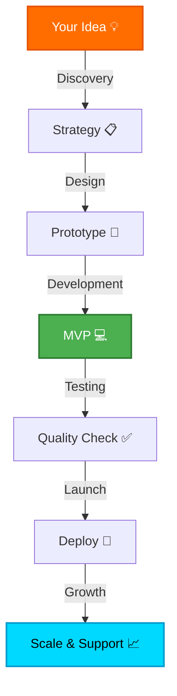

<div align="center">

<!-- Animated Header -->


<h3>
  
</h3>

<p align="center">
  <a href="https://sd-codehub.github.io/SD-CodeHub-Web/"></a>
  <a href="https://github.com/SD-CodeHub"></a>
  <a href="https://instagram.com/sd_codehub"></a>
  <a href="https://www.linkedin.com/in/sd-codehub-97aa91389/"></a>
</p>


</div>

<br>

<!-- About Section with Gradient Box -->
<div align="center">

## 🎯 Who We Are

<table>
<tr>
<td>


**SD CodeHub** is where **creativity meets code**. We're not just developers – we're *digital artists* crafting experiences that captivate and convert.

```yaml
mission: "Transform Ideas into Digital Reality"
vision: "Empower businesses through innovation"
values: [Quality, Innovation, Excellence]
```

### ⚡ The SD CodeHub Difference

🎨 **Design-First Approach** - Beauty meets functionality  
💻 **Code That Scales** - Built for growth  
🚀 **Lightning Fast** - Optimized performance  
🔒 **Secure & Reliable** - Your trust, our priority  
📱 **Responsive Always** - Perfect on every device  
♿ **Accessible** - Inclusive by design  

</td>
</tr>
</table>

</div>

<br>

<!-- Services Section with Cards -->
<div align="center">

## 💼 Our Magic Services


</div>

<table>
<tr>
<td width="33%" align="center">

### 🎨 UI/UX DESIGN


**Crafting Visual Stories**

```
✦ Wireframing & Prototyping
✦ User Research & Testing
✦ Design Systems & Style Guides
✦ Brand Identity & Visual Design
✦ Micro-Interactions & Animations
✦ Design Thinking Workshops
✦ Usability Audits
```


</td>
<td width="33%" align="center">

### 💻 FULL-STACK DEV


**Building Digital Engines**

```
✦ Web & Mobile Applications
✦ Progressive Web Apps (PWA)
✦ RESTful & GraphQL APIs
✦ Admin Dashboards & Panels
✦ E-commerce Platforms
✦ Real-time Applications
✦ CMS & Database Design
```


</td>
<td width="33%" align="center">

### 🚀 GROWTH SERVICES


**Scaling Your Success**

```
✦ Brand Strategy & Identity
✦ Logo & Visual Design
✦ SEO & Performance
✦ Analytics & Insights
✦ Maintenance & Support
✦ Product Consulting
✦ Cloud Deployment
```


</td>
</tr>
</table>

<br>

<!-- Tech Stack Section -->
<div align="center">

## 🛠️ Our Arsenal


### **Frontend Mastery**

<p>

</p>

### **Backend Excellence**

<p>

</p>

### **Design Tools**

<p>

</p>

### **DevOps & Tools**

<p>

</p>

</div>

<br>

<!-- Stats Section -->
<div align="center">

## 📊 By The Numbers


<table>
<tr>
<td align="center" width="25%">

<br><b>5+ Projects</b>
<br>Successfully Delivered
</td>
<td align="center" width="25%">

<br><b>10+ Clients</b>
<br>Happy & Growing
</td>
<td align="center" width="25%">

<br><b>1+ Years</b>
<br>Industry Experience
</td>
<td align="center" width="25%">

<br><b>98% Rating</b>
<br>Client Satisfaction
</td>
</tr>
</table>


</div>

<br>

<!-- Why Choose Us -->
<div align="center">

## 🌟 Why SD CodeHub?
</div>

<table>
<tr>
<td width="50%">

```javascript
const whyChooseUs = {
  approach: "Design-First Development",
  methodology: "Agile & Transparent",
  quality: "Pixel-Perfect Excellence",
  security: "Enterprise-Grade Protection",
  scalability: "Built for Growth",
  communication: "24/7 Support",
  delivery: "Always On Time",
  innovation: "Cutting-Edge Solutions"
};

console.log("🚀 Your Success = Our Mission");
```

</td>
<td width="50%">

### 🎯 Our Promise



</td>
</tr>
</table>

<br>

<!-- Process Section -->
<div align="center">

## ⚙️ Our Battle-Tested Process


</div>

```
┏━━━━━━━━━━━━━━━━━━━━━━━━━━━━━━━━━━━━━━━━━━━━━━━━━━━━━━━━━━━━━━━━━━━━━━━━┓
┃  01. 🔍 DISCOVERY    →  Deep dive into your vision & goals              ┃
┃  ━━━━━━━━━━━━━━━━━━━━━━━━━━━━━━━━━━━━━━━━━━━━━━━━━━━━━━━━━━━━━━━━━━━  ┃
┃  02. 📋 STRATEGY     →  Blueprint creation & tech stack selection       ┃
┃  ━━━━━━━━━━━━━━━━━━━━━━━━━━━━━━━━━━━━━━━━━━━━━━━━━━━━━━━━━━━━━━━━━━━  ┃
┃  03. 🎨 DESIGN       →  Wireframes, prototypes & visual magic           ┃
┃  ━━━━━━━━━━━━━━━━━━━━━━━━━━━━━━━━━━━━━━━━━━━━━━━━━━━━━━━━━━━━━━━━━━━  ┃
┃  04. 💻 DEVELOPMENT  →  Clean code, best practices & optimization       ┃
┃  ━━━━━━━━━━━━━━━━━━━━━━━━━━━━━━━━━━━━━━━━━━━━━━━━━━━━━━━━━━━━━━━━━━━  ┃
┃  05. 🧪 TESTING      →  Rigorous QA, performance & security checks      ┃
┃  ━━━━━━━━━━━━━━━━━━━━━━━━━━━━━━━━━━━━━━━━━━━━━━━━━━━━━━━━━━━━━━━━━━━  ┃
┃  06. 🚀 LAUNCH       →  Deployment, monitoring & go-live support        ┃
┃  ━━━━━━━━━━━━━━━━━━━━━━━━━━━━━━━━━━━━━━━━━━━━━━━━━━━━━━━━━━━━━━━━━━━  ┃
┃  07. 📈 GROWTH       →  Continuous support, updates & scaling           ┃
┗━━━━━━━━━━━━━━━━━━━━━━━━━━━━━━━━━━━━━━━━━━━━━━━━━━━━━━━━━━━━━━━━━━━━━━━━┛
```

<br>

<!-- Testimonials -->
<div align="center">

## 💬 Client Love


</div>

<table>
<tr>
<td width="33%" align="center">

⭐⭐⭐⭐⭐

*"SD CodeHub transformed our vision into reality. Their attention to detail is **unmatched**!"*

**— Sarah M.**  
Startup Founder

</td>
<td width="33%" align="center">

⭐⭐⭐⭐⭐

*"Professional, creative, incredibly responsive. **Best development partner** we've worked with."*

**— James L.**  
Business Owner

</td>
<td width="33%" align="center">

⭐⭐⭐⭐⭐

*"They don't just build websites; they **create experiences**. Highly recommended!"*

**— Priya K.**  
Marketing Director

</td>
</tr>
</table>

<br>

<!-- Contact Section -->
<div align="center">

## 📬 Let's Build Something Epic


### 🚀 Ready to Transform Your Digital Presence?

<a href="mailto:codehubsd@gmail.com">
  
</a>

<br><br>

<a href="https://www.sdcodehub.com">
  
</a>
<a href="https://github.com/SD-CodeHub">
  
</a>

<br>

<a href="https://instagram.com/sd_codehub">
  
</a>
<a href="https://www.linkedin.com/in/sd-codehub-97aa91389/">
  
</a>

<br><br>


</div>

<br>

<!-- Mission Statement -->
<div align="center">

## 🌍 Our Mission


> ### *"To bridge the gap between aesthetic design and powerful technology,*  
> ### *delivering digital experiences that engage, empower, and inspire."*

</div>

<br>

<!-- Footer -->
<div align="center">

---

### 💡 Design. Develop. Deliver.

**At SD CodeHub, we don't just design and develop — we build digital experiences that inspire.**

<br>


<br><br>

### ⭐ Star this repo if you found it inspiring! ⭐

<br>

**© 2025 SD CodeHub. All Rights Reserved.**

<br>


</div>
